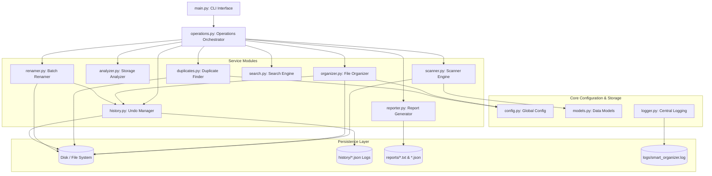
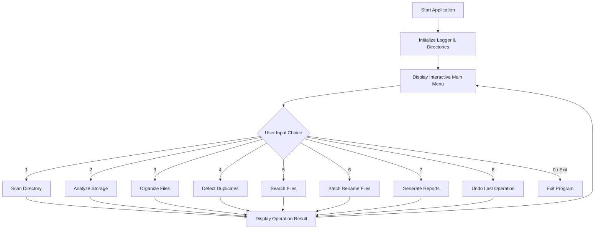
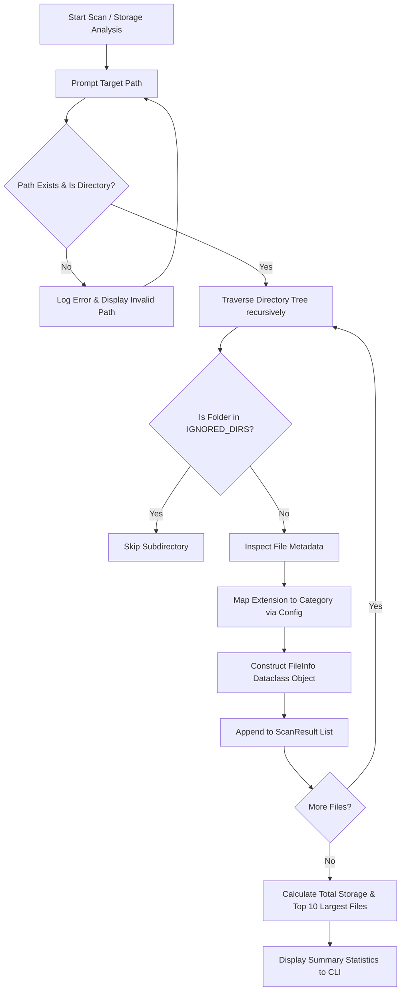
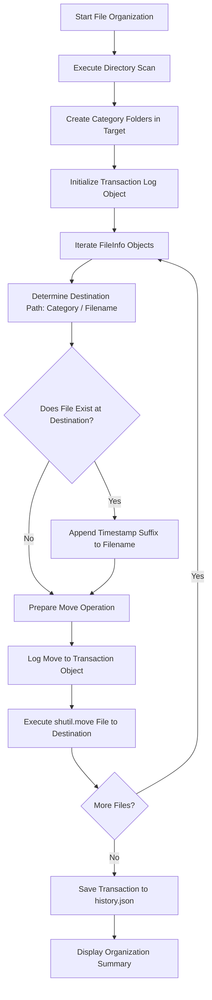
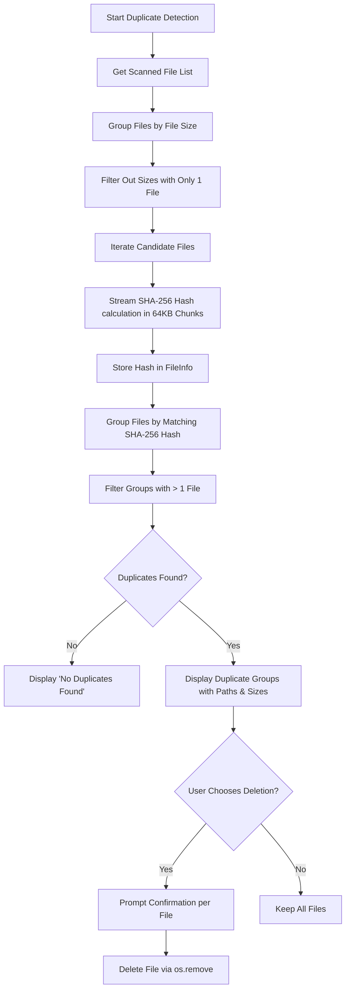
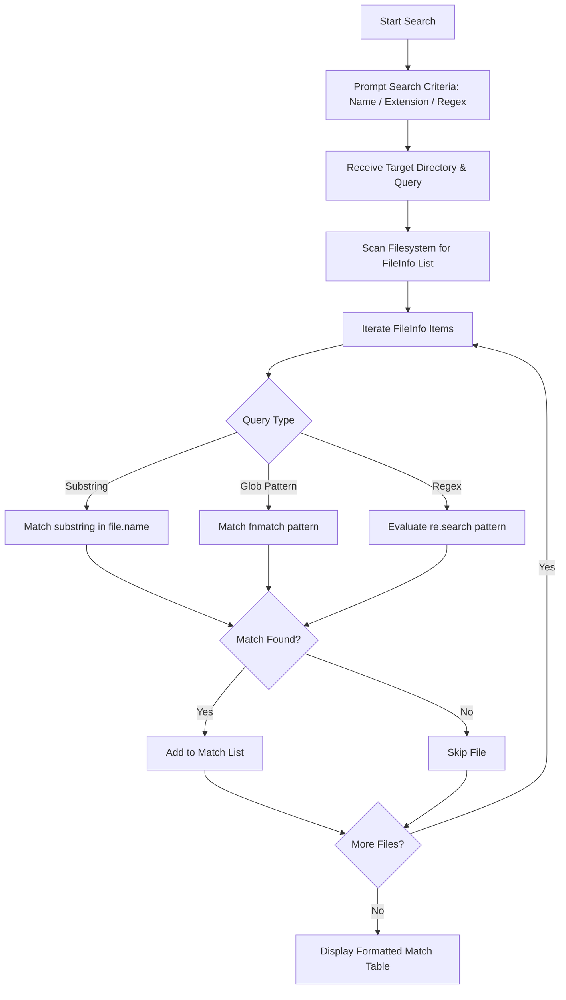
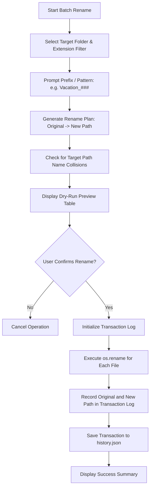
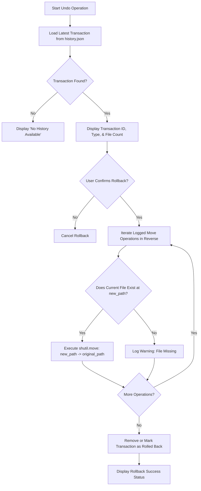

# Comprehensive Implementation Plan: Smart File Organizer & Storage Analyzer

---

## 1. Project Overview

### Goals
Build a production-grade, modular, and resilient Python command-line application that intelligently scans, analyzes, categorizes, deduplicates, searches, renames, and reports on file storage while maintaining full transactional undo safety.

### Scope
- **Target Platform**: Cross-platform (Windows, macOS, Linux).
- **Runtime**: Python 3.8+ utilizing Python Standard Library (with optional `rich`/`colorama` terminal styling).
- **Operational Boundary**: Arbitrary user-selected directories with user-configurable folder exclusion and category mapping.

### Functional Requirements
1. **Directory Scanner**: Recursively scans target folder, gathering metadata (`path`, `size`, `category`, `modified_time`, `extension`).
2. **Storage Analyzer**: Identifies total storage used, category distribution, and top $N$ largest files.
3. **Smart File Organizer**: Categorizes and moves files into organized subfolders using `shutil.move()` with automatic collision resolution.
4. **SHA256 Duplicate Detector**: Group files by size, compute chunked SHA-256 hashes, and prompt user for selective cleanup.
5. **File Search Engine**: Search directory trees using substring, wildcard (`fnmatch`), extension, or regular expressions.
6. **Batch Renamer**: Sequential pattern-based batch renaming with dry-run preview capabilities.
7. **Report Generator**: Generates human-readable (`report.txt`) and machine-readable (`report.json`) summaries.
8. **Undo Transaction Engine**: Records all file movements into structured transaction logs (`history.json`) and provides full rollback capabilities.
9. **Logging System**: Production logging (`logs/smart_organizer.log`) replacing raw `print()` for debugging and auditability.

### Non-Functional Requirements
- **Memory Safety**: Stream large file reads in chunks (e.g., 64KB buffers) during hashing to avoid RAM spikes.
- **Fault Tolerance**: Handle permission errors, read-only locks, and missing paths gracefully without application crashes.
- **Atomicity & Safety**: Log every file mutation before executing the physical disk operation to guarantee reversibility.
- **Maintainability**: Strict separation of concerns across presentation (CLI), operations, configuration, data models, and core services.

---

## 2. High-Level System Architecture

The application adopts a **Layered Service Architecture** to decouple user interface, business logic, configuration, and disk operations.

```
                            ┌─────────────────────────┐
                            │        User / CLI       │
                            └────────────┬────────────┘
                                         │
                                         ▼
                            ┌─────────────────────────┐
                            │     CLI (main.py)       │
                            └────────────┬────────────┘
                                         │
                                         ▼
                            ┌─────────────────────────┐
                            │   Operations Layer      │
                            │    (operations.py)      │
                            └────────────┬────────────┘
                                         │
     ┌───────────┬───────────┬───────────┼───────────┬───────────┬───────────┐
     ▼           ▼           ▼           ▼           ▼           ▼           ▼
 ┌───────┐   ┌───────┐   ┌───────┐   ┌───────┐   ┌───────┐   ┌───────┐   ┌───────┐
 │Scanner│   │Analyze│   │Organiz│   │Duplic.│   │Search │   │Renamer│   │Report │
 └───┬───┘   └───┬───┘   └───┬───┘   └───┬───┘   └───┬───┘   └───┬───┘   └───┬───┘
     │           │           │           │           │           │           │
     └───────────┴───────────┴─────┬─────┴───────────┴───────────┴───────────┘
                                   │
                                   ▼
                      ┌─────────────────────────┐
                      │ Configuration & Models  │
                      │   (config.py / models)  │
                      └────────────┬────────────┘
                                   │
                                   ▼
                      ┌─────────────────────────┐
                      │ Transaction & Logging   │
                      │  (history.py / logger)  │
                      └────────────┬────────────┘
                                   │
                                   ▼
                      ┌─────────────────────────┐
                      │       File System       │
                      └─────────────────────────┘
```

---

## 3. Complete Folder Structure

```
smart-file-organizer/
│
├── main.py                 # CLI entry point, menu loops, flag parsing
├── config.py               # Global settings, file categories, constants
├── models.py               # Core Dataclasses (FileInfo, ScanResult, Transaction)
├── operations.py           # High-level orchestration layer coordinating tools
├── scanner.py              # Directory traversal & FileInfo generation
├── analyzer.py             # Storage analytics & top size calculations
├── organizer.py            # Categorization logic & file movement
├── duplicates.py           # SHA256 hashing & duplicate finding logic
├── search.py               # Query matching engine (substring, regex, glob)
├── renamer.py              # Pattern-based batch file renaming engine
├── reporter.py             # Exporting TXT and JSON report summaries
├── history.py              # Undo engine & transaction log manager
├── logger.py               # Logging configuration (Console & File handlers)
├── utils.py                # Formatting helpers, size conversions, path validators
│
├── reports/                # Auto-generated TXT/JSON report outputs
├── history/                # Saved transaction logs (history.json)
├── logs/                   # System runtime log files (smart_organizer.log)
├── sample_data/            # Mock folder structure for testing/demonstration
│
├── README.md               # User documentation & usage instructions
└── IMPLEMENTATION_PLAN.md  # Architectural blueprint & development roadmap
```

### Folder Purpose Documentation
- `reports/`: Stores timestamped summary files (`report_YYYYMMDD_HHMMSS.txt` and `.json`) generated by `reporter.py`.
- `history/`: Contains atomic transaction logs (`history_<transaction_id>.json`) enabling multi-level rollbacks.
- `logs/`: Holds execution log files (`smart_organizer.log`) recording INFO, WARNING, and ERROR diagnostics.
- `sample_data/`: Contains dummy images, documents, videos, and duplicate test files to safely test features without affecting real data.

---

## 4. Module Responsibilities

| Module | Purpose | Primary Inputs | Primary Outputs | Key Public Functions | Dependencies |
| :--- | :--- | :--- | :--- | :--- | :--- |
| **`main.py`** | Application lifecycle & interactive CLI menu | User keystrokes / Arguments | Terminal UI / Operation triggers | `main()`, `display_menu()` | `operations.py`, `logger.py`, `utils.py` |
| **`config.py`** | Central configuration repository | Environment / Overrides | Immutable constants & config dicts | `load_config()`, `get_category()` | None |
| **`models.py`** | Strict type definitions & dataclasses | Raw file data / Dictionaries | Strongly typed Objects | Dataclasses (`FileInfo`, `Transaction`) | `dataclasses`, `typing`, `pathlib` |
| **`operations.py`** | Orchestrates tasks between modules | CLI commands & params | Status responses / Operation results | `run_scan()`, `run_organize()`, `run_undo()` | All service modules, `logger.py` |
| **`scanner.py`** | Reads filesystem tree and extracts metadata | Target directory `Path` | `ScanResult` (`List[FileInfo]`) | `scan_directory()` | `models.py`, `config.py`, `utils.py` |
| **`analyzer.py`** | Calculates storage statistics | `List[FileInfo]` | Storage metrics dict / Top N files | `analyze_storage()`, `get_largest_files()` | `models.py`, `utils.py` |
| **`organizer.py`** | Moves files into categorized folders | `List[FileInfo]`, target path | `Transaction` object | `organize_files()` | `models.py`, `config.py`, `history.py` |
| **`duplicates.py`** | Identifies duplicate files via SHA-256 | `List[FileInfo]` | `Dict[str, List[FileInfo]]` | `find_duplicates()`, `delete_duplicates()`| `models.py`, `config.py`, `logger.py` |
| **`search.py`** | Filters files by criteria | `List[FileInfo]`, query string | `List[FileInfo]` | `search_files()` | `models.py`, `re`, `fnmatch` |
| **`renamer.py`** | Batch renames files safely | `List[FileInfo]`, pattern | Rename plan / Execution count | `preview_rename()`, `execute_rename()` | `models.py`, `history.py` |
| **`reporter.py`** | Generates formatted reports | `ScanResult`, analysis data | `report.txt`, `report.json` | `generate_text_report()`, `generate_json_report()`| `models.py`, `config.py` |
| **`history.py`** | Manages transaction logs & rollback execution | `Transaction` / JSON log | Rollback operation success boolean | `save_transaction()`, `rollback_last_transaction()`| `models.py`, `config.py`, `logger.py` |
| **`logger.py`** | System-wide logging setup | Log levels, stream targets | Formatted log handlers | `setup_logger()`, `get_logger()` | `logging`, `config.py` |
| **`utils.py`** | Utility helper functions | Bytes, raw paths, strings | Human strings, validated `Path` | `format_size()`, `validate_path()` | `pathlib` |

---

## 5. Core Data Model

```python
from dataclasses import dataclass, field
from pathlib import Path
from datetime import datetime
from typing import List, Dict, Optional

@dataclass
class FileInfo:
    """Represents metadata of an individual file."""
    path: Path               # Absolute path on disk
    name: str                # Filename with extension (e.g. resume.pdf)
    extension: str           # Lowercase extension (e.g. .pdf)
    size_bytes: int          # Raw file size in bytes
    category: str            # Mapped category (e.g. Documents, Images)
    modified_time: datetime  # Last modification timestamp
    sha256: Optional[str] = None  # Computed lazily during duplicate detection

@dataclass
class ScanResult:
    """Encapsulates the complete result of a directory scan."""
    root_path: Path
    total_files: int
    total_size_bytes: int
    files: List[FileInfo]
    category_counts: Dict[str, int]
    scan_duration_seconds: float

@dataclass
class FileMoveOperation:
    """Records a single file movement for rollback."""
    original_path: str
    new_path: str
    timestamp: str

@dataclass
class Transaction:
    """Represents an atomic operation containing multiple file movements."""
    transaction_id: str
    action_type: str  # e.g., "ORGANIZE", "RENAME"
    timestamp: str
    operations: List[FileMoveOperation] = field(default_factory=list)
```

### Field Justifications
- **`FileInfo.sha256`**: Kept optional to avoid calculating expensive hashes during initial scanning. Hash computation is deferred until duplicate detection.
- **`ScanResult.scan_duration_seconds`**: Used for performance benchmarking and reporting.
- **`FileMoveOperation.original_path` & `new_path`**: Absolute string representations ensuring precise reverse relocation during rollbacks.

---

## 6. Configuration Design (`config.py`)

```python
from pathlib import Path

# Base Paths
BASE_DIR = Path(__file__).parent.resolve()
REPORTS_DIR = BASE_DIR / "reports"
HISTORY_DIR = BASE_DIR / "history"
LOGS_DIR = BASE_DIR / "logs"

# Performance Settings
HASH_CHUNK_SIZE = 65536  # 64 KB read buffer for SHA256 hashing

# Ignored Directories (Skipped during recursive scanning)
IGNORED_DIRS = {
    ".git", ".svn", "__pycache__", ".venv", "node_modules",
    "$RECYCLE.BIN", "System Volume Information"
}

# Category Extension Mappings
DEFAULT_CATEGORIES = {
    "Images": [".jpg", ".jpeg", ".png", ".gif", ".bmp", ".svg", ".webp"],
    "Documents": [".pdf", ".docx", ".doc", ".txt", ".xlsx", ".pptx", ".csv", ".md"],
    "Videos": [".mp4", ".mkv", ".avi", ".mov", ".wmv", ".flv"],
    "Music": [".mp3", ".wav", ".flac", ".aac", ".ogg"],
    "Archives": [".zip", ".tar", ".gz", ".7z", ".rar"],
    "Code": [".py", ".js", ".html", ".css", ".java", ".cpp", ".c", ".json"],
    "Executables": [".exe", ".msi", ".bat", ".sh"]
}

# Default Category for unrecognized extensions
UNKNOWN_CATEGORY = "Others"
```

---

## 7. Complete Data Flow Diagram

```
                 Filesystem Disk Traversal
                            │
                            ▼
                    scanner.scan_directory()
                            │
                            ▼
                   List[FileInfo] Objects
                            │
       ┌────────────────────┼────────────────────┐
       ▼                    ▼                    ▼
analyzer.py             organizer.py        duplicates.py
(Compute Size &        (Determine Paths     (Compute SHA256 &
 Distribution)          & Execute Move)      Group Matches)
       │                    │                    │
       │                    ▼                    │
       │             history.save_tx()           │
       │                    │                    │
       └────────────────────┼────────────────────┘
                            │
                            ▼
                    reporter.py
                            │
               ┌────────────┴────────────┐
               ▼                         ▼
          report.txt                report.json
               │                         │
               └────────────┬────────────┘
                            │
                            ▼
                       CLI Output
```

---

## 8. Detailed System Design Diagram



---

## 9. Complete Flowcharts

### 9.1 Startup / Main CLI Flowchart


### 9.2 Directory Scanning & Storage Analyzer Flowchart


### 9.3 Organizer Flowchart


### 9.4 Duplicate Detection Flowchart


### 9.5 Search Flowchart


### 9.6 Batch Rename Flowchart


### 9.7 Undo / Rollback Flowchart


---

## 10. Development Roadmap

### Phase 1: Foundation Setup
- **Estimated Files**: `config.py`, `models.py`, `utils.py`, `logger.py`
- **Expected Output**: Core foundational classes, constants, size formatting utilities, and logger initialization.
- **Git Commit**: `feat: initialize project architecture, configuration, core models, and logging`
- **Deliverables**:
  - `FileInfo`, `ScanResult`, and `Transaction` dataclasses.
  - Category map configuration dictionary.
  - Human-readable byte formatters (`format_size(1073741824) -> '1.00 GB'`).
- **Common Mistakes**: Hardcoding file paths or standardizing categories as strings rather than enum/config parameters.
- **Done Checklist**:
  - [✅] `models.py` passes type checking.
  - [✅] Logger successfully writes to `logs/smart_organizer.log`.

### Phase 2: Directory Scanner Engine
- **Estimated Files**: `scanner.py`
- **Expected Output**: Functional scanner capable of traversing nested folders and returning structured `ScanResult`.
- **Git Commit**: `feat: add recursive scanner engine with category extension mapping`
- **Deliverables**:
  - Directory recursive scanner skipping `IGNORED_DIRS`.
  - Extension normalization and category mapping logic.
- **Common Mistakes**: Falling into infinite loops on symlinks or crashing on permission-denied folders.
- **Done Checklist**:
  - [ ] Tested scanning folder containing 500+ dummy files.
  - [ ] Permission errors logged safely without terminating execution.

### Phase 3: Storage Analyzer
- **Estimated Files**: `analyzer.py`
- **Expected Output**: Storage metrics calculator identifying category distributions and top largest files.
- **Git Commit**: `feat: implement storage analysis and top largest files calculation`
- **Deliverables**:
  - Aggregation of bytes per category.
  - Sorting and extraction of top $N$ largest files.
- **Common Mistakes**: Sorting files without using raw byte values (e.g. sorting strings like `"100 MB"` instead of raw integer bytes).
- **Done Checklist**:
  - [ ] Top 10 largest files correctly identified and sorted.

### Phase 4: File Organizer & History Engine
- **Estimated Files**: `organizer.py`, `history.py`
- **Expected Output**: Organizer moving files into subfolders and logging transactions to `history.json`.
- **Git Commit**: `feat: implement smart file organizer and transaction history manager`
- **Deliverables**:
  - `shutil.move()` categorizer creation.
  - Automatic timestamp suffix generation for destination filename collisions.
  - Atomic transaction JSON writer.
- **Common Mistakes**: Moving files before recording the initial transaction log.
- **Done Checklist**:
  - [ ] Files correctly sorted into `Images/`, `Documents/`, etc.
  - [ ] `history/history_<id>.json` created with full rollback mapping.

### Phase 5: SHA256 Duplicate Detector
- **Estimated Files**: `duplicates.py`
- **Expected Output**: Chunked SHA-256 duplicate identification and interactive cleanup prompt.
- **Git Commit**: `feat: implement chunked SHA256 duplicate detection and cleanup engine`
- **Deliverables**:
  - Size pre-filtering optimization.
  - 64KB chunked file hasher.
  - Interactive deletion confirmation prompt.
- **Common Mistakes**: Loading entire multi-gigabyte files into RAM with `.read()` instead of buffering chunks.
- **Done Checklist**:
  - [ ] Identical content files correctly identified regardless of filenames.

### Phase 6: Search & Batch Renamer
- **Estimated Files**: `search.py`, `renamer.py`
- **Expected Output**: File search tool and sequential batch renaming engine with dry-run preview.
- **Git Commit**: `feat: add file search engine and batch renamer with dry-run preview`
- **Deliverables**:
  - Substring, glob, and regex search filter algorithms.
  - Sequential zero-padded pattern renamer (`Vacation_001.jpg`).
- **Common Mistakes**: Overwriting files during batch rename when target names collide.
- **Done Checklist**:
  - [ ] Dry-run preview displays before executing actual file renaming.

### Phase 7: Reporter Engine & Operations Orchestration
- **Estimated Files**: `reporter.py`, `operations.py`
- **Expected Output**: TXT and JSON report generator and high-level operations controller.
- **Git Commit**: `feat: implement TXT/JSON reporter and operations orchestration layer`
- **Deliverables**:
  - Structured text table and JSON reporting writers.
  - Central `operations.py` API connecting CLI to service functions.
- **Common Mistakes**: Mixing CLI user prompt logic inside calculation services.
- **Done Checklist**:
  - [ ] Reports exported successfully to `reports/` folder.

### Phase 8: Interactive CLI & Final Integration
- **Estimated Files**: `main.py`, `README.md`
- **Expected Output**: Complete interactive CLI menu system and documentation.
- **Git Commit**: `feat: complete interactive CLI interface and release Version 1.0`
- **Deliverables**:
  - User-friendly terminal interface with menu navigation loops.
  - Final integration testing across all features.
- **Common Mistakes**: Unhandled user inputs leading to application crashes.
- **Done Checklist**:
  - [ ] Full end-to-end testing completed with 100% features verified.

---

## 11. Git Commit Roadmap

```bash
# Commit 1: Architecture Setup
git commit -m "feat: initialize project structure, configuration, core models, and logging framework"

# Commit 2: Scanner Implementation
git commit -m "feat: add recursive scanner engine with extension categorization"

# Commit 3: Storage Analyzer
git commit -m "feat: implement storage analysis and largest file extraction"

# Commit 4: History & Rollback Engine
git commit -m "feat: implement transaction logging and atomic undo engine"

# Commit 5: File Organizer
git commit -m "feat: implement smart file organizer with name collision resolution"

# Commit 6: SHA256 Duplicate Detector
git commit -m "feat: implement chunked SHA256 hashing for duplicate detection"

# Commit 7: Search Engine
git commit -m "feat: add search engine with substring, glob, and regex pattern matching"

# Commit 8: Batch Renamer
git commit -m "feat: implement batch renamer with dry-run preview verification"

# Commit 9: Reporter Engine
git commit -m "feat: implement text and JSON report generation tools"

# Commit 10: Operations Orchestrator
git commit -m "feat: orchestrate service layers via unified operations controller"

# Commit 11: Main CLI Interface
git commit -m "feat: build interactive CLI menu system and command-line parser"

# Commit 12: Documentation & Release
git commit -m "docs: finalize user documentation and release Version 1.0"
```

---

## 12. Logging Design (`logger.py`)

Instead of relying on unformatted `print()` statements scattered across modules, the application implements standard Python `logging`.

### Configuration Details
- **Log File Path**: `logs/smart_organizer.log`
- **Format**: `%(asctime)s - [%(levelname)s] - %(name)s - %(message)s`
- **Dual Handlers**:
  - **FileHandler**: Logs `DEBUG`, `INFO`, `WARNING`, `ERROR`, `CRITICAL` for full audit trails.
  - **StreamHandler**: Logs `WARNING` and `ERROR` alerts cleanly to the terminal console without cluttering the UI.

---

## 13. Undo Transaction Design (`history.py`)

Every file movement operation (organization, batch renaming, duplicate deletion) records a transaction before executing disk changes.

### Sample Transaction JSON Schema (`history/history_tx_1001.json`)
```json
{
  "transaction_id": "tx_20260807_154500",
  "action_type": "ORGANIZE",
  "timestamp": "2026-08-07T15:45:00",
  "operations": [
    {
      "original_path": "S:\\Data\\Downloads\\resume.pdf",
      "new_path": "S:\\Data\\Downloads\\Documents\\resume.pdf",
      "timestamp": "2026-08-07T15:45:01"
    },
    {
      "original_path": "S:\\Data\\Downloads\\vacation.jpg",
      "new_path": "S:\\Data\\Downloads\\Images\\vacation.jpg",
      "timestamp": "2026-08-07T15:45:02"
    }
  ]
}
```

---

## 14. Error Handling Strategy

Centralized exception handling prevents unexpected application crashes and guarantees clear diagnostic messages.

### Exception Hierarchy
```
Exception
 └── OrganizerException (Base Custom Exception)
      ├── PermissionDeniedException
      ├── InvalidPathException
      └── RollbackFailedException
```

### Layer Rules
1. **Service Layer (`scanner`, `organizer`, `duplicates`)**:
   - Catches lower-level OS exceptions (`PermissionError`, `FileNotFoundError`).
   - Logs errors to `logger.error()`.
   - Wraps and re-raises domain-specific exceptions (`OrganizerException`).
2. **CLI Layer (`main.py`)**:
   - Catches domain-specific exceptions.
   - Displays user-friendly error notifications without displaying raw stack trace dumps.
